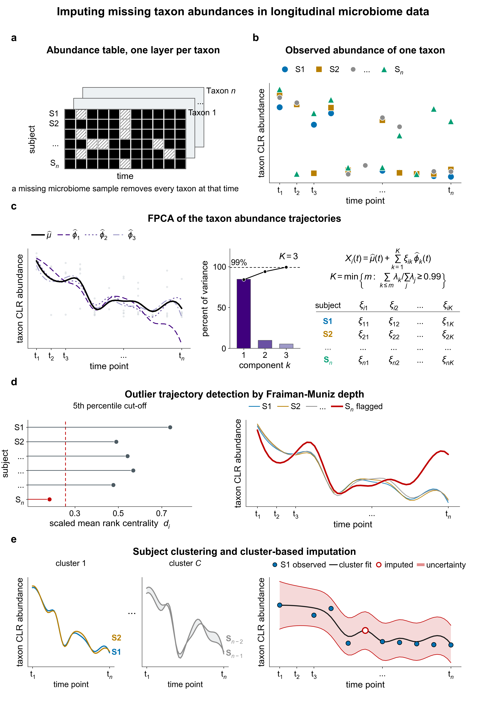

<!-- badges: start -->
[](https://github.com/FarahpourLab/MicrobiomeCurves/actions/workflows/check-bioc.yaml)
<!-- badges: end -->

# MicrobiomeCurves

<div align="justify">

MicrobiomeCurves imputes missing time points in longitudinal microbiome data. Missing samples arise when a subject withdraws or misses a scheduled collection, or when a subject dies or is culled before the time course ends. A collection may also yield too little material to process, fail during DNA extraction or library preparation, degrade during shipping, or produce too few reads to pass quality control.

The package models each taxon's abundance over time as a smooth trajectory. It borrows recurring patterns across subjects using functional principal component analysis (FPCA) in the PACE formulation. Every imputed value has a 95% interval, and the package draws the trajectories used to infer it.

The covariance surface that drives FPCA is estimated from the subjects that remain after outlier screening, which removes trajectories that sit far from the rest. When clustering is used, it is estimated from the cluster containing the target subject. This sharing across subjects allows the model to fit data in which each subject has only a few time points.



The vignette walks through this figure panel by panel.

## Installation

MicrobiomeCurves requires R 4.5.0 or later. Its CRAN dependencies are `cluster`, `dplyr`, `fda.usc`, `fdapace`, `ggplot2`, `magrittr`, `patchwork`, `stringr`, `tibble`, `tidyr`, and `withr`. Its Bioconductor dependencies are `S4Vectors`, `SummarizedExperiment`, and `TreeSummarizedExperiment`. It also uses the base R packages `grDevices`, `grid`, `methods`, `stats`, and `utils`. Nothing is installed from GitHub, and no system library beyond R itself is needed.

```r
if (!requireNamespace("remotes", quietly = TRUE))
    install.packages("remotes")

remotes::install_github("FarahpourLab/MicrobiomeCurves",
                        build_vignettes = TRUE)
```

## Quick start

Provide an abundance table with taxa in the row names and one column per sample. Provide a metadata table with one row per sample. The metadata identifies the sample, subject, and time point.

```r
library(MicrobiomeCurves)

taxa <- c(
    "Bacteroides", "Faecalibacterium", "Bifidobacterium", "Akkermansia"
)
subjects <- paste0("SUB", sprintf("%02d", 1:6))
days <- c(0, 7, 14)

# meta: one row per sample, saying which subject it came from and when.
# Any column names will do; you name them in the call below.
meta <- expand.grid(
    SubjectID = subjects, Day = days,
    KEEP.OUT.ATTRS = FALSE, stringsAsFactors = FALSE
)
meta <- meta[order(meta$SubjectID, meta$Day), ]
meta$SampleID <- sprintf("S%03d", seq_len(nrow(meta)))
meta <- meta[, c("SampleID", "SubjectID", "Day")]
rownames(meta) <- NULL

# SUB03 missed the day-14 collection, so that sample does not exist.
meta <- meta[!(meta$SubjectID == "SUB03" & meta$Day == 14), ]

# counts: a taxa-by-samples matrix. Taxa in the ROW NAMES, one column per
# sample, named however the sequencing run named it. Raw counts here.
set.seed(1)
counts <- matrix(
    rpois(length(taxa) * nrow(meta), lambda = c(420, 200, 80, 35)),
    nrow = length(taxa),
    dimnames = list(taxa, meta$SampleID)
)
```

```r
counts[, 1:5]
#>                  S001 S002 S003 S004 S005
#> Bacteroides       407  388  413  411  432
#> Faecalibacterium  218  206  188  199  212
#> Bifidobacterium    91   86   74   88   86
#> Akkermansia        37   38   33   39   35

head(meta)
#>   SampleID SubjectID Day
#> 1     S001     SUB01   0
#> 2     S002     SUB01   7
#> 3     S003     SUB01  14
#> 4     S004     SUB02   0
#> 5     S005     SUB02   7
#> 6     S006     SUB02  14
```

Six subjects at three time points would give 18 samples. This one has 17. The sample for SUB03 at day 14 does not exist, and that is the gap the package fills.

```r
run <- mc_run(
    counts, meta,
    sample_col     = "SampleID",
    subject_col    = "SubjectID",
    time_col       = "Day",
    abundance_type = "raw",   # counts; use "clr" if already transformed
    out_dir        = "results",
    C = 1                     # pool all subjects when fitting each taxon;
                              # C = NULL groups similar trajectories instead
                              # and picks how many groups per taxon
)
#> Transforming raw abundances to centred log-ratios.
#> Design: 4 taxa, 17 samples, 6 subjects, 3 time points.
#>   time points, in order: 0, 7, 14
#>   missing: 1 of 18 subject-timepoints (5.6%).
#>     1 with no sample at all: SUB03 at 14
#> Detected 1 missing sample(s) across 6 subject(s) and 3 time point(s).
#> Creating 1 empty column(s) for absent samples.
#> Fitting FPCA model over 4 taxa ...
#> Done: 4 of 4 cell(s) imputed.
#> Drawing uncertainty for 4 taxa ...
#> Wrote 5 file(s) to results: imputed_clr.tsv,
#>   imputed_relative_abundance.tsv, imputed_counts.tsv,
#>   imputation_log.txt, uncertainty_by_taxon.pdf
```

Set `abundance_type = "raw"` for counts or relative abundances. The package replaces zeros and applies the centred log-ratio (CLR) transformation. Use `"clr"` for values that are already transformed.

`C` controls how subjects are combined before an imputed value is computed. `C = 1` pools all subjects, runs fastest, and is the usual starting point. `C = NULL` creates clusters of similar trajectories for each taxon and selects the number of clusters by silhouette width. This can help when subjects have distinct response patterns, but takes considerably longer.

Outlier screening is enabled by default with `use_outliers = TRUE`. It uses functional depth to flag trajectories that sit far from the rest and leaves them out of the fit.

Drawing can be turned off with `plots = FALSE`. Setting `plot_format = "png"` or `plot_format = "both"` also writes one image per page at `dpi`, which defaults to 300. The PDF uses vector graphics, so `dpi` does not affect it.

Time may be numeric or a label such as `"Baseline"`, `"Week1"`, or `"Week4"`. Factor values follow the factor levels. Other values follow metadata row order, and the package reports the order for checking.

The model uses the order of the time points, not their numeric values. Days 0, 7, and 14 are fitted exactly as 0, 1, and 2. Unequal spacing is not represented in the fitted trajectory. The original values remain in reports, on uncertainty plot axes, and in names for created sample columns.

## What you get back

`run$completed` contains CLR values and keeps the caller's sample names. Samples are ordered by subject and then by time. Observed values are unchanged. A new column is created only when a subject has no sample at a time point, and `run$metadata` marks that column as imputed.

```r
run$completed[, 1:5]
#>              taxon       S001       S002       S003       S004
#> 1      Bacteroides  1.1300418  1.1158016  1.2583320  1.1553941
#> 2 Faecalibacterium  0.5057236  0.4826724  0.4713264  0.4301057
#> 3  Bifidobacterium -0.3679119 -0.3908564 -0.4610505 -0.3858623
#> 4      Akkermansia -1.2678535 -1.2076176 -1.2686080 -1.1996375

run$metadata[run$metadata$imputed, ]
#>      sample subject time time_label imputed
#> 18 SUB03_14   SUB03   14         14    TRUE
```

The `results` directory contains three abundance tables:

- `imputed_clr.tsv` contains the completed table on the CLR scale produced by the model.

- `imputed_relative_abundance.tsv` contains proportions that sum to one within each sample.

- `imputed_counts.tsv` contains the completed table on the count scale.

For raw input, collected samples remain unchanged in both the relative-abundance and count output tables, including zeros. Only created samples are reconstructed. Each created sample receives the median library size of the study. A taxon below the value used to replace zero during the CLR step is written as zero.

```r
read.delim("results/imputed_relative_abundance.tsv")[, 1:5]
#>              taxon       S001       S002       S003       S004
#> 1      Bacteroides 0.54050465 0.54038997 0.58333333 0.55766621
#> 2 Faecalibacterium 0.28950863 0.28690808 0.26553672 0.27001357
#> 3  Bifidobacterium 0.12084993 0.11977716 0.10451977 0.11940299
#> 4      Akkermansia 0.04913679 0.05292479 0.04661017 0.05291723

read.delim("results/imputed_counts.tsv")[, 1:5]
#>              taxon S001 S002 S003 S004
#> 1      Bacteroides  407  388  413  411
#> 2 Faecalibacterium  218  206  188  199
#> 3  Bifidobacterium   91   86   74   88
#> 4      Akkermansia   37   38   33   39
```

These count columns are unchanged from the input because those samples were collected.

For CLR input, the package has no library sizes or structural zeros. Inverting the CLR produces strictly positive proportions, so an original zero appears as a small positive value. Counts use one library size for the whole table, inferred from the rarest taxon. They are on a plausible scale, not the original scale. The log records whether raw or CLR input was used.

`imputation_log.txt` records the design, the ordered time points, each missing subject and time point with its reason, the scales written, and every warning. For this example it includes:

```text
MISSING (1 of 18 subject-timepoints)
  SUB03  at time 14  [absent_sample]  no sample was collected
```

The information printed to the screen is also available in `run$design` and `run$missing`.

## With SummarizedExperiment

`mc_run()` has methods for `SummarizedExperiment` and `TreeSummarizedExperiment`. Subject and time are read from `colData`, and the completed matrix is added as a new assay.

## Uncertainty

`uncertainty_by_taxon.pdf` shows every subject's trajectory, the fitted trajectory, and the 95% band for the subject with the missing sample.

Each page covers one taxon. That taxon's imputed values appear side by side as facets. Past six imputed values they continue onto further pages, so none are dropped. Before drawing a large number of pages, the package says how many it will draw.

With outlier screening on, a page shows two fits: one using all subjects and one excluding the flagged trajectories. The difference between them shows what outlier screening did to the imputed value. With screening off, the page shows one fit.

The intervals are also available as a table from `mc_uncertainty(run, taxon)`.

## Documentation

Read the workflow vignette for the method, output details, and uncertainty options:

```r
vignette("MicrobiomeCurves-workflow", package = "MicrobiomeCurves")
```

`mc_demo_data()` returns the bundled example. `mc_from_metadata()` reports the study design without fitting the model.

## Citation

```r
citation("MicrobiomeCurves")
```

## License

GPL-3.

</div>
